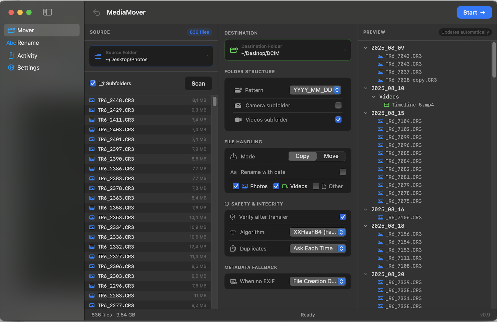

# FolioSort

A native macOS app to organize and rename photos, videos, and other files based on EXIF metadata or file dates. Inspired by PhotoMove2, with full video, RAW format, non-media file support, and a built-in Mass Rename tool.

## Download

**[Download latest DMG](https://github.com/tiagotrindade/FolioSort/releases/latest)** — macOS 14+ (Apple Silicon & Intel)

## Screenshot



## Features

### Media Organization (Mover)
- **EXIF-based sorting** — reads DateTaken from photo EXIF data
- **Video metadata** — reads creation date from MOV, MP4, MKV and other formats
- **7 folder patterns** — YYYY/MM/DD, YYYY/MM, YYYY_MM_DD, with camera model variants
- **Copy or Move mode** — choose whether to keep or move originals
- **Non-media files** — optionally include documents, archives, and any other file types
- **Preview before organizing** — scan files and review how they'll be sorted before committing
- **Subfolder toggle** — include or exclude subfolders from the source directory

### Date Handling
- **EXIF date chain**: DateTimeOriginal → DateTimeDigitized → TIFFDateTime (supports scanned photos)
- **Subsecond precision**: parses EXIF dates with milliseconds (e.g. Nikon, Sony cameras)
- **File Creation Date** fallback (default) when no EXIF/metadata is found
- **File Modification Date** fallback as alternative
- **Skip** files with no metadata date available
- **UTC-consistent** folder sorting — dates are interpreted in UTC to avoid timezone drift

### File Renaming
- **Rename with date** — prepend full timestamp to filenames
- Format: `YYYYMMDD_HHMMSSmmm_originalname.ext` (down to the millisecond)
- Example: `20260312_143522123_IMG_4567.jpg`

### Folder Organization
- **Camera subfolder** — create subfolders by camera model (e.g. `2026/03/12/iPhone 15 Pro/`)
- **Videos subfolder** — separate videos into a `Videos` subfolder (e.g. `2026/03/12/Videos/`)
- Both options can be combined with any folder pattern

### Mass Rename
- **7 naming patterns** — Date prefix, Date-Time prefix, Sequential numbering, Camera model prefix, and more
- **Live preview** — see before/after filenames before applying
- **Rename in place or copy** — rename files where they are, or copy renamed files to a new folder
- **Subfolder toggle** — include or exclude subfolders
- **Other Files support** — include non-media files with sequential numbering
- **Batch processing** — rename hundreds of files in seconds

### Integrity Verification
- **Post-copy/move checksum** verification enabled by default
- **XXHash64** — fast hashing for large batches
- **SHA-256** — option for maximum security
- Detects corrupted files immediately after transfer
- **Move mode**: source hash is computed before the move and compared after — no false positives

### Duplicate Detection
- **Ask Each Time** — per-file dialog: rename, replace, replace if larger, or skip (with "apply to all" option)
- **Automatic** — configurable default action (rename / replace / replace if larger)
- **Don't Move** — skip all duplicates

### Activity Log
- Full operation log with timestamps and status indicators
- Searchable and filterable (by status or text)
- Export log file for external review

### Undo
- Reverse the last batch operation with one click
- Copy undo: removes copied files
- Move undo: moves files back to original location
- Persistent history across sessions (up to 50 batches)
- Automatic cleanup of empty directories

### Supported Formats

**Photos**: JPG, JPEG, PNG, HEIC, HEIF, TIFF, TIF, BMP, GIF, WebP

**RAW Photos**: CR2, CR3, CRW (Canon), NEF, NRW (Nikon), ARW, SR2, SRF (Sony), DNG (Adobe), ORF (Olympus), RAF (Fujifilm), RW2 (Panasonic), PEF (Pentax), SRW (Samsung), X3F (Sigma), IIQ, 3FR, FFF (Medium Format), RWL, MRW, ERF, KDC, DCR

**Videos**: MOV, MP4, AVI, MKV, M4V, 3GP, WMV, FLV, WebM, MTS, M2TS, TS, MPG, MPEG, VOB

**RAW Video**: BRAW (Blackmagic), R3D (RED), ARI/ARR (ARRI), CRM (Canon Cinema)

**Other**: Any file type can be included via the "Other Files" toggle

## Requirements

- macOS 14 (Sonoma) or later
- Apple Silicon (M1/M2/M3/M4) or Intel Mac

## Build from Source

```bash
# Build and run
swift build && swift run

# Create .app bundle
make app

# Create .dmg for distribution
make dmg
```

## Usage

The app uses a sidebar with four sections: **Mover**, **Rename**, **Activity**, and **Settings**.

### Mover (Organize files into folders)
The Mover view has three panels: source file list, configuration, and a live folder tree preview.

1. Select a **source folder** in the left panel — click **Scan** to enumerate files
2. Select a **destination folder** in the configuration panel
3. Choose a **folder pattern** (e.g., YYYY/MM/DD, YYYY_MM_DD, etc.)
4. Configure options:
   - **Mode**: Copy or Move
   - **Camera / Videos subfolder**: create subfolders by camera model or media type
   - **Rename with date**: prepend timestamp to filenames
   - **File types**: Photos, Videos, Other Files
   - **Duplicates**: Ask, Automatic, or Skip
   - **Integrity**: XXHash64 or SHA-256 post-transfer verification
   - **Date fallback**: Creation date, Modification date, or Skip
5. The **Preview panel** updates automatically as you change settings
6. Click **Start** (top right) to organize

Use the **↩ Undo** button in the toolbar to reverse the last operation.

### Rename (Batch rename files)
The Rename view has three panels: source file list, pattern configuration, and a before→after preview.

1. Select a **source folder** — click **Scan**
2. Choose a **naming pattern** (Date prefix, Date-Time, Sequential, Camera model, etc.)
3. Choose **Rename in Place** or **Copy to Folder**
4. Preview the before/after filenames in the right panel
5. Click **Rename All** (or **Copy & Rename**) to apply

### Activity
Full operation history with timestamps, status indicators, search, and export.

## License

MIT License
